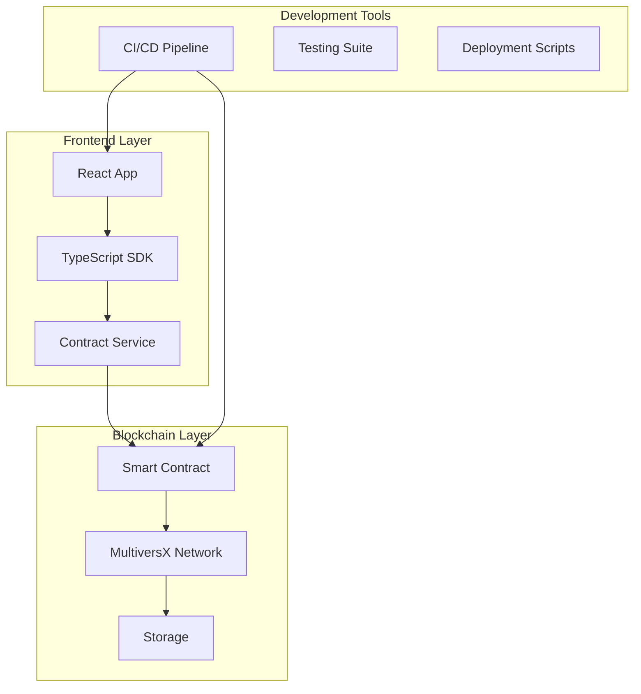

# Development Guide - MultiversX OnChain Proof

> Comprehensive development guide for the MultiversX OnChain Proof project

## 🚀 Quick Start

### Prerequisites

```bash
# MultiversX CLI
pipx install multiversx-sdk-cli --force

# Rust for smart contracts
curl --proto '=https' --tlsv1.2 -sSf https://sh.rustup.rs | sh
rustup target add wasm32-unknown-unknown

# Node.js for frontend
node --version  # v18+
npm --version
```

### Setup

```bash
# Clone and setup
git clone https://github.com/Gzeu/mvx-onchain-proof.git
cd mvx-onchain-proof

# Smart contract setup
cd contract
mxpy deps install rust --overwrite
cd ..

# Frontend setup
cd frontend-modern
npm install
cd ..

# Make scripts executable
chmod +x deploy-scripts/*.sh
```

## 🏗️ Architecture Overview



## 📋 Smart Contract Development

### Core Structure

```rust
// Main data structure
#[derive(TypeAbi, TopEncode, TopDecode, Clone)]
pub struct ProofData<M: ManagedTypeApi> {
    pub proof_text: ManagedBuffer<M>,
    pub timestamp: u64,
    pub proof_id: ManagedBuffer<M>,
    pub metadata: ManagedBuffer<M>,
}
```

### Key Features

- **Multiple proofs per user** - Store unlimited certificates
- **Unique proof IDs** - Prevent duplicates globally
- **Metadata support** - Rich data structures
- **Ownership tracking** - Proof management system
- **Event logging** - Complete audit trail

### Development Workflow

```bash
cd contract

# 1. Code formatting
cargo fmt

# 2. Linting
cargo clippy --all-targets --all-features -- -D warnings

# 3. Run tests
cargo test

# 4. Build contract
sc-meta all build

# 5. Generate ABI
sc-meta all abi
```

### Adding New Features

#### 1. Storage Mapper
```rust
#[storage_mapper("featureName")]
fn feature_name(&self) -> SingleValueMapper<DataType>;
```

#### 2. Endpoint Function
```rust
#[endpoint(functionName)]
fn function_name(&self, param: ManagedBuffer) {
    require!(!param.is_empty(), "Parameter required");
    // Implementation
}
```

#### 3. View Function
```rust
#[view(getFeature)]
fn get_feature(&self) -> DataType {
    self.feature_name().get()
}
```

#### 4. Add Tests
```rust
#[test]
fn feature_test() {
    let mut world = world();
    // Test implementation
}
```

## 🖥️ Frontend Development

### Tech Stack

- **React 18** - UI framework with hooks
- **TypeScript** - Type-safe development
- **Tailwind CSS** - Utility-first styling
- **Vite** - Fast build tool
- **MultiversX SDK** - Blockchain integration
- **React Query** - Data fetching and caching

### Project Structure

```
frontend-modern/
├── src/
│   ├── components/     # Reusable UI components
│   ├── hooks/          # Custom React hooks
│   ├── utils/          # Utility functions
│   ├── services/       # API and contract services
│   ├── types/          # TypeScript type definitions
│   └── pages/          # Route components
├── public/             # Static assets
└── package.json        # Dependencies
```

### Contract Integration

#### 1. Service Initialization
```typescript
import { createDevNetContractService } from '@/utils/contractService';

const contractService = createDevNetContractService('erd1...');
```

#### 2. Wallet Connection
```typescript
// Connect wallet
await contractService.connectWallet('extension');

// Get user address
const address = await contractService.getUserAddress();
```

#### 3. Contract Interactions
```typescript
// Create proof
const txHash = await contractService.certifyAction({
  proofText: 'Certificate text',
  proofId: 'UNIQUE_ID',
  metadata: JSON.stringify({ type: 'course' })
});

// Get user proofs
const proofs = await contractService.getUserProofs(address);
```

### Custom Hooks

```typescript
// Hook for contract interactions
function useContract() {
  const [service] = useState(() => createDevNetContractService(CONTRACT_ADDRESS));
  const [isConnected, setIsConnected] = useState(false);
  
  const connectWallet = async (type: WalletType) => {
    await service.connectWallet(type);
    setIsConnected(true);
  };
  
  return { service, isConnected, connectWallet };
}

// Hook for user proofs
function useUserProofs(address: string) {
  return useQuery(
    ['userProofs', address],
    () => contractService.getUserProofs(address),
    { enabled: !!address }
  );
}
```

### Component Example

```typescript
import React from 'react';
import { ProofData } from '@/types';

interface ProofCardProps {
  proof: ProofData;
  onEdit?: () => void;
  onVerify?: () => void;
}

export function ProofCard({ proof, onEdit, onVerify }: ProofCardProps) {
  const createdDate = new Date(proof.timestamp * 1000);
  
  return (
    <div className="bg-white rounded-lg shadow-lg p-6 border border-gray-200">
      <div className="flex justify-between items-start mb-4">
        <h3 className="text-lg font-semibold text-gray-900">
          {proof.proof_text}
        </h3>
        <span className="px-2 py-1 bg-green-100 text-green-800 rounded-full text-sm">
          Verified
        </span>
      </div>
      
      <div className="text-sm text-gray-600 mb-4">
        <p><strong>ID:</strong> {proof.proof_id}</p>
        <p><strong>Created:</strong> {createdDate.toLocaleDateString()}</p>
        {proof.metadata && (
          <p><strong>Type:</strong> {JSON.parse(proof.metadata).type}</p>
        )}
      </div>
      
      <div className="flex gap-2">
        {onEdit && (
          <button
            onClick={onEdit}
            className="px-4 py-2 bg-blue-500 text-white rounded hover:bg-blue-600 transition-colors"
          >
            Edit
          </button>
        )}
        {onVerify && (
          <button
            onClick={onVerify}
            className="px-4 py-2 bg-gray-500 text-white rounded hover:bg-gray-600 transition-colors"
          >
            Verify
          </button>
        )}
      </div>
    </div>
  );
}
```

## 🧪 Testing Strategy

### Smart Contract Tests

#### Unit Tests
```bash
# Run all tests
cd contract && cargo test

# Run specific test
cargo test certify_action_test

# Run with output
cargo test -- --nocapture
```

#### Integration Tests
```rust
#[test]
fn comprehensive_workflow_test() {
    let mut world = world();
    
    world
        .start_trace()
        .set_state_step(/* Setup accounts */)
        .sc_deploy(/* Deploy contract */)
        .sc_call(/* Create proof 1 */)
        .sc_call(/* Create proof 2 */)
        .sc_query(/* Verify proofs */)
        .check_state_step(/* Validate final state */);
}
```

### Frontend Tests

#### Component Testing
```typescript
import { render, screen, fireEvent, waitFor } from '@testing-library/react';
import { ProofCard } from '@/components/ProofCard';

test('displays proof information correctly', () => {
  const mockProof = {
    proof_text: 'Test Certificate',
    timestamp: 1640995200,
    proof_id: 'TEST_001',
    metadata: JSON.stringify({ type: 'course' })
  };
  
  render(<ProofCard proof={mockProof} />);
  
  expect(screen.getByText('Test Certificate')).toBeInTheDocument();
  expect(screen.getByText('TEST_001')).toBeInTheDocument();
  expect(screen.getByText(/course/)).toBeInTheDocument();
});

test('handles edit action', async () => {
  const handleEdit = jest.fn();
  
  render(<ProofCard proof={mockProof} onEdit={handleEdit} />);
  
  fireEvent.click(screen.getByText('Edit'));
  
  await waitFor(() => {
    expect(handleEdit).toHaveBeenCalled();
  });
});
```

#### Service Testing
```typescript
import { ContractService } from '@/utils/contractService';

describe('ContractService', () => {
  let service: ContractService;
  
  beforeEach(() => {
    service = new ContractService(mockConfig);
  });
  
  test('validates proof ID correctly', () => {
    expect(service.validateProofId('VALID_ID_123')).toEqual({ valid: true });
    expect(service.validateProofId('')).toEqual({
      valid: false,
      error: 'Proof ID cannot be empty'
    });
  });
  
  test('formats proof for display', () => {
    const formatted = service.formatProofForDisplay(mockProof);
    expect(formatted).toContain('Test Certificate');
    expect(formatted).toContain('Created:');
  });
});
```

## 🚀 Deployment Guide

### DevNet Deployment

```bash
# Using enhanced deployment script
./deploy-scripts/deploy-devnet.sh wallet.pem --verify --test --save-abi

# Manual deployment
cd contract
mxpy contract deploy \
  --bytecode=./output/onchain-proof.wasm \
  --pem=wallet.pem \
  --gas-limit=100000000 \
  --proxy=https://devnet-gateway.multiversx.com \
  --chain=D \
  --send \
  --wait-result
```

### MainNet Deployment

```bash
# Production build
cd contract
sc-meta all build --target-dir ../target

# Security audit
cargo audit

# Deploy with high gas limit
mxpy contract deploy \
  --bytecode=./output/onchain-proof.wasm \
  --pem=mainnet-wallet.pem \
  --gas-limit=150000000 \
  --proxy=https://gateway.multiversx.com \
  --chain=1 \
  --send
```

### Frontend Deployment

#### Vercel
```bash
cd frontend-modern

# Install Vercel CLI
npm i -g vercel

# Deploy
vercel --prod
```

#### Netlify
```bash
# Build
npm run build

# Deploy
netlify deploy --prod --dir=dist
```

#### Docker
```dockerfile
# Multi-stage build
FROM node:18-alpine as build
WORKDIR /app
COPY package*.json ./
RUN npm ci --only=production
COPY . .
RUN npm run build

FROM nginx:alpine
COPY --from=build /app/dist /usr/share/nginx/html
COPY nginx.conf /etc/nginx/nginx.conf
EXPOSE 80
CMD ["nginx", "-g", "daemon off;"]
```

## 🔄 CI/CD Pipeline

### GitHub Actions Workflow

The project includes comprehensive CI/CD:

- **Smart Contract Testing** - Rust tests with coverage
- **Frontend Testing** - React component and unit tests
- **Security Audit** - Dependency vulnerability scanning
- **Build Validation** - Multi-environment builds
- **Deployment** - Automated DevNet deployment
- **Release Management** - Automated releases with assets

### Workflow Triggers

- **Push to main** - Full test suite + DevNet deployment
- **Pull requests** - Test suite validation
- **Tags** - Release creation with artifacts
- **Manual trigger** - Custom deployment options

## 🛠️ Development Tools

### VS Code Extensions

```json
{
  "recommendations": [
    "rust-lang.rust-analyzer",
    "ms-vscode.vscode-typescript-next",
    "bradlc.vscode-tailwindcss",
    "esbenp.prettier-vscode",
    "ms-vscode.vscode-json"
  ]
}
```

### Environment Configuration

```bash
# Create .env.local
cp frontend-modern/.env.example frontend-modern/.env.local

# Edit configuration
vim frontend-modern/.env.local
```

```env
# Frontend environment variables
REACT_APP_NETWORK=devnet
REACT_APP_CHAIN_ID=D
REACT_APP_PROXY_URL=https://devnet-gateway.multiversx.com
REACT_APP_CONTRACT_ADDRESS=erd1qqqqqqqqqqqqqpgq...
REACT_APP_WALLET_CONNECT_PROJECT_ID=your_project_id
```

### Debug Configuration

#### Smart Contract Debugging
```rust
// Add debug prints
sc_print!("Debug: Processing proof ID: {}", proof_id);

// Conditional compilation for debug
#[cfg(feature = "debug")]
sc_print!("Debug info: {}", debug_info);
```

#### Frontend Debugging
```typescript
// Development logging
if (process.env.NODE_ENV === 'development') {
  console.log('Contract interaction:', { proofId, txHash });
}

// Error boundary for React components
class ErrorBoundary extends React.Component {
  componentDidCatch(error: Error, errorInfo: React.ErrorInfo) {
    console.error('Component error:', error, errorInfo);
  }
}
```

## 🤝 Contributing Guidelines

### Development Process

1. **Fork & Clone**
   ```bash
   git clone https://github.com/YOUR_USERNAME/mvx-onchain-proof.git
   git remote add upstream https://github.com/Gzeu/mvx-onchain-proof.git
   ```

2. **Feature Branch**
   ```bash
   git checkout -b feature/proof-expiration
   ```

3. **Development**
   - Write code following project standards
   - Add comprehensive tests
   - Update documentation
   - Ensure CI passes

4. **Pull Request**
   - Clear description of changes
   - Reference related issues
   - Include screenshots if UI changes
   - Wait for code review

### Code Standards

#### Smart Contract
- Follow Rust naming conventions (`snake_case`)
- Add `require!` statements for validation
- Include comprehensive error messages
- Optimize for gas efficiency
- Document all public functions

```rust
/// Creates a new proof certificate for the caller
/// 
/// # Arguments
/// * `proof_text` - Description of the certificate (1-500 characters)
/// * `proof_id` - Unique identifier for this proof
/// * `metadata` - Optional additional data as JSON string
/// 
/// # Panics
/// * If proof_id already exists
/// * If proof_text is empty or too long
#[endpoint(certifyAction)]
fn certify_action(
    &self,
    proof_text: ManagedBuffer,
    proof_id: ManagedBuffer,
    metadata: OptionalValue<ManagedBuffer>,
) {
    // Implementation
}
```

#### Frontend
- Use TypeScript for all new code
- Follow React hooks patterns
- Implement proper error boundaries
- Use semantic HTML elements
- Ensure mobile responsiveness

```typescript
// Component with proper typing
interface ProofFormProps {
  onSubmit: (proof: CreateProofRequest) => Promise<void>;
  loading?: boolean;
  error?: string | null;
}

export function ProofForm({ onSubmit, loading = false, error }: ProofFormProps) {
  // Implementation with proper error handling
}
```

### Git Conventions

```bash
# Commit message format
type(scope): description

# Examples
feat(contract): add proof expiration functionality
fix(frontend): resolve wallet connection timeout
docs(readme): update deployment instructions
test(contract): add integration tests for batch operations
```

## 🐛 Troubleshooting

### Common Issues

#### Contract Build Failures
```bash
# Solution 1: Clean rebuild
cd contract
rm -rf target/ output/
mxpy deps install rust --overwrite
sc-meta all build

# Solution 2: Update dependencies
cargo update
sc-meta all build
```

#### Frontend Build Errors
```bash
# Solution 1: Clear cache
cd frontend-modern
rm -rf node_modules/ .vite/ dist/
npm install

# Solution 2: Check Node version
node --version  # Should be v18+
```

#### Wallet Connection Issues
- Ensure wallet extension is installed and unlocked
- Check network matches contract deployment
- Clear browser local storage
- Try different wallet provider

#### Transaction Failures
- Verify sufficient EGLD balance
- Check gas limit is adequate
- Ensure contract address is correct
- Validate function parameters

### Debug Commands

```bash
# Query contract state
mxpy contract query CONTRACT_ADDRESS \
  --proxy=PROXY_URL \
  --function=getTotalProofs

# Check transaction status
mxpy tx get --hash=TX_HASH --proxy=PROXY_URL

# Validate wallet
mxpy wallet pem-address wallet.pem

# Check account balance
mxpy account get --address=ADDRESS --proxy=PROXY_URL
```

## 📚 Additional Resources

### Documentation
- [MultiversX Docs](https://docs.multiversx.com/)
- [Smart Contract Guide](https://docs.multiversx.com/developers/smart-contracts/)
- [SDK Documentation](https://github.com/multiversx/mx-sdk-js-core)

### Examples
- [Contract Templates](https://github.com/multiversx/mx-contracts-rs)
- [dApp Examples](https://github.com/multiversx/mx-template-dapp)
- [SDK Examples](https://github.com/multiversx/mx-sdk-js-examples)

### Community
- [MultiversX Discord](https://discord.gg/multiversx)
- [Developer Forum](https://github.com/multiversx/mx-sdk-rs/discussions)
- [Stack Overflow](https://stackoverflow.com/questions/tagged/multiversx)

### Tools
- [MultiversX IDE](https://marketplace.visualstudio.com/items?itemName=Elrond.vscode-elrond-ide)
- [Contract Verifier](https://github.com/multiversx/mx-contracts-verify)
- [Network Explorers](https://explorer.multiversx.com/)

---

**Happy coding! 🚀**

For questions or support, please create an issue on GitHub or reach out to the maintainers.