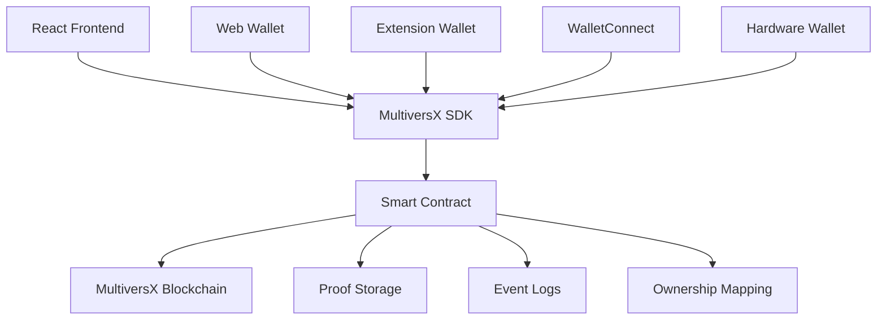

# 🏷️ MultiversX OnChain Proof

[](https://opensource.org/licenses/MIT)
[](https://multiversx.com/)
[](https://www.typescriptlang.org/)
[](https://reactjs.org/)
[](https://www.rust-lang.org/)

> **Universal smart contract for badges, certificates, and attestations on MultiversX blockchain - 100% secure, zero fund management!**

A comprehensive solution for creating immutable, verifiable proofs on the MultiversX blockchain. Perfect for certificates, badges, timestamps, and professional attestations with zero financial risk.

## ✨ Features

### 🔒 **Zero-Risk Design**
- **No fund management** - Smart contract doesn't handle any tokens
- **Read-only wallet access** - Cannot access your private keys
- **Gas-only costs** - Only pay network fees (~$0.001 EGLD)

### 🎯 **Multiple Use Cases**
- **🏆 Event Badges** - Hackathons, conferences, workshops
- **📜 Certificates** - Course completions, achievements, qualifications  
- **⏰ Timestamps** - Document existence proofs, IP protection
- **💼 Professional Attestations** - Skills, endorsements, milestones
- **🔐 Identity Verification** - KYC proofs, identity confirmations

### 🚀 **Advanced Features**
- **Multiple proofs per user** - Store unlimited certificates
- **Unique proof IDs** - Prevent duplicates and conflicts
- **Metadata support** - Rich data structures
- **Proof ownership** - Transfer and manage certificates
- **Event logging** - Track all proof activities
- **Modern React frontend** - Professional user interface
- **Multi-wallet support** - Web, Extension, WalletConnect, Hardware

## 🏗️ Architecture



## 🚀 Quick Start

### Prerequisites

```bash
# Install MultiversX CLI
pipx install multiversx-sdk-cli --force

# Verify installation
mxpy --version
```

### 1. Clone Repository

```bash
git clone https://github.com/Gzeu/mvx-onchain-proof.git
cd mvx-onchain-proof
```

### 2. Smart Contract Setup

```bash
cd contract

# Install dependencies
mxpy deps install rust --overwrite

# Build contract
sc-meta all build
```

### 3. Deploy Contract

#### DevNet Deployment
```bash
mxpy contract deploy \
  --bytecode=./output/onchain-proof.wasm \
  --keyfile=walletKey.json \
  --gas-limit=100000000 \
  --proxy=https://devnet-gateway.multiversx.com \
  --chain=D \
  --send
```

#### MainNet Deployment
```bash
mxpy contract deploy \
  --bytecode=./output/onchain-proof.wasm \
  --keyfile=walletKey.json \
  --gas-limit=100000000 \
  --proxy=https://gateway.multiversx.com \
  --chain=1 \
  --send
```

### 4. Frontend Setup

```bash
cd frontend-modern

# Install dependencies
npm install

# Start development server
npm run dev

# Build for production
npm run build
```

## 📖 Smart Contract API

### Core Functions

#### `certify_action(proof_text, proof_id, metadata?)`
**Creates a new proof certificate**

```rust
// Parameters
proof_text: ManagedBuffer  // Certificate description (1-500 chars)
proof_id: ManagedBuffer    // Unique identifier
metadata: OptionalValue<ManagedBuffer>  // Additional data

// Gas Cost: ~50,000 gas
```

#### `update_proof(proof_id, new_proof_text, new_metadata?)`
**Updates an existing proof (owner only)**

```rust
// Parameters
proof_id: ManagedBuffer           // Existing proof ID
new_proof_text: ManagedBuffer     // Updated description
new_metadata: OptionalValue<ManagedBuffer>  // Updated metadata
```

### Query Functions

#### `get_proof(user, proof_id) -> ProofData`
**Retrieves a specific proof**

#### `get_user_proofs(user) -> Array<ProofData>`
**Gets all proofs for a user**

#### `get_user_proof_ids(user) -> Array<string>`
**Lists all proof IDs for a user**

#### `get_proof_owner(proof_id) -> Address`
**Returns the owner of a proof**

#### `get_total_proofs() -> number`
**Gets total number of proofs in system**

### Data Structures

```rust
pub struct ProofData {
    pub proof_text: ManagedBuffer,  // Certificate description
    pub timestamp: u64,             // Creation timestamp
    pub proof_id: ManagedBuffer,    // Unique identifier
    pub metadata: ManagedBuffer,    // Additional data
}
```

## 💡 Usage Examples

### Hackathon Participation Badge

```javascript
const proofData = {
  proof_text: "Participated in MultiversX Hackathon 2025 - Blockchain category",
  proof_id: "HACKATHON_2025_MVX_GEORGE_001",
  metadata: JSON.stringify({
    event: "MultiversX Hackathon 2025",
    category: "Blockchain Development",
    location: "Bucharest, Romania",
    date: "2025-09-19",
    organizer: "MultiversX Foundation"
  })
};

await contract.certify_action(proofData.proof_text, proofData.proof_id, proofData.metadata);
```

### Course Completion Certificate

```javascript
const certificateData = {
  proof_text: "Successfully completed Advanced Smart Contracts Development Course",
  proof_id: "CERT_SMART_CONTRACTS_ADV_2025_001",
  metadata: JSON.stringify({
    course: "Advanced Smart Contracts Development",
    institution: "TechAcademy",
    score: 95,
    duration: "6 weeks",
    skills: ["Rust", "MultiversX", "DeFi", "NFTs"]
  })
};
```

### Document Timestamp Proof

```javascript
const timestampData = {
  proof_text: "Document existence proof for intellectual property",
  proof_id: "IP_PROOF_2025_PATENT_APPLICATION_001",
  metadata: JSON.stringify({
    document_hash: "sha256:a1b2c3d4e5f6789...",
    document_type: "Patent Application",
    author: "George Pricop",
    title: "Innovative Blockchain Solution"
  })
};
```

## 🌐 Frontend Features

### Modern React Interface
- **🎨 Tailwind CSS** - Beautiful, responsive design
- **🔌 Multi-wallet support** - Web, Extension, WalletConnect, Hardware
- **📱 Mobile responsive** - Works on all devices
- **🌙 Dark/Light mode** - User preference support
- **📊 Dashboard** - View all your proofs
- **🔍 Search & Filter** - Find proofs quickly
- **📤 Export options** - PDF, JSON export
- **🔗 Share proofs** - Generate shareable links

### Key Components
- **Wallet Connection** - Seamless wallet integration
- **Proof Creation** - Intuitive certificate builder
- **Proof Gallery** - Visual proof management
- **Verification Tools** - Validate any proof
- **Analytics** - Usage statistics and insights

## 🔧 Development

### Project Structure

```
mvx-onchain-proof/
├── contract/                 # Smart contract (Rust)
│   ├── src/lib.rs           # Main contract logic
│   ├── Cargo.toml           # Rust dependencies
│   └── output/              # Build artifacts
├── frontend-modern/         # Modern React frontend
│   ├── src/                 # React components
│   ├── package.json         # Node.js dependencies
│   └── vite.config.ts       # Build configuration
├── frontend-example/        # Simple HTML demo
├── deploy-scripts/          # Deployment automation
├── .github/                 # CI/CD workflows
└── docs/                    # Documentation
```

### Smart Contract Development

```bash
# Run tests
cd contract
cargo test

# Check contract
sc-meta all build

# Generate ABI
sc-meta all abi
```

### Frontend Development

```bash
# Development mode
cd frontend-modern
npm run dev

# Type checking
npm run type-check

# Linting
npm run lint

# Production build
npm run build
```

### Testing

```bash
# Smart contract tests
cd contract && cargo test

# Frontend tests
cd frontend-modern && npm test

# E2E tests
npm run test:e2e
```

## 📊 Proof Format Standards

### Educational Certificates
```json
{
  "type": "EDUCATION",
  "course": "Course Name",
  "institution": "Institution Name",
  "completion_date": "2025-09-19",
  "score": 95,
  "duration": "Duration",
  "skills": ["skill1", "skill2"]
}
```

### Event Participation
```json
{
  "type": "EVENT",
  "event_name": "Event Name",
  "date": "2025-09-19",
  "role": "Participant/Speaker/Organizer",
  "location": "City, Country",
  "category": "Technology/Business/etc"
}
```

### Professional Attestation
```json
{
  "type": "PROFESSIONAL",
  "skill": "Skill Name",
  "level": "Beginner/Intermediate/Advanced/Expert",
  "endorser": "Company/Organization",
  "valid_until": "2026-09-19",
  "verification_url": "https://..."
}
```

## 🛣️ Roadmap

### ✅ Phase 1 - Foundation (Completed)
- [x] Basic smart contract with single proof per user
- [x] Simple HTML frontend
- [x] Deployment scripts
- [x] Basic documentation

### ✅ Phase 2 - Enhanced Smart Contract (Completed)
- [x] Multiple proofs per user
- [x] Unique proof ID system
- [x] Metadata support
- [x] Proof ownership tracking
- [x] Update functionality
- [x] Event logging

### ✅ Phase 3 - Modern Frontend (Completed)
- [x] React + TypeScript application
- [x] Tailwind CSS styling
- [x] Multi-wallet integration
- [x] Responsive design
- [x] Proof management dashboard

### 🔄 Phase 4 - Advanced Features (In Progress)
- [ ] Proof templates system
- [ ] Batch operations
- [ ] Proof expiration dates
- [ ] Digital signatures integration
- [ ] IPFS metadata storage
- [ ] QR code generation
- [ ] Mobile app

### 🎯 Phase 5 - Enterprise Features (Planned)
- [ ] Organization accounts
- [ ] Bulk certificate issuance
- [ ] API endpoints
- [ ] Webhook notifications
- [ ] Advanced analytics
- [ ] White-label solutions
- [ ] Integration plugins

### 🚀 Phase 6 - Ecosystem Integration (Future)
- [ ] Cross-chain compatibility
- [ ] DID integration
- [ ] Educational platform partnerships
- [ ] Employer verification tools
- [ ] Marketplace for certificates
- [ ] AI-powered verification

## 🤝 Contributing

We welcome contributions! Here's how to get started:

### Development Setup

1. **Fork the repository**
2. **Clone your fork**
   ```bash
   git clone https://github.com/YOUR_USERNAME/mvx-onchain-proof.git
   cd mvx-onchain-proof
   ```
3. **Create a feature branch**
   ```bash
   git checkout -b feature/amazing-feature
   ```
4. **Make your changes**
5. **Test thoroughly**
   ```bash
   # Test smart contract
   cd contract && cargo test
   
   # Test frontend
   cd frontend-modern && npm test
   ```
6. **Commit your changes**
   ```bash
   git commit -m 'Add amazing feature'
   ```
7. **Push and create PR**
   ```bash
   git push origin feature/amazing-feature
   ```

### Contribution Guidelines

- **Code Quality**: Follow existing patterns and style
- **Testing**: Add tests for new features
- **Documentation**: Update docs for any changes
- **Security**: No fund handling, security-first approach
- **Performance**: Optimize gas usage in smart contracts

### Development Standards

- **Smart Contract**: Rust with MultiversX framework
- **Frontend**: React + TypeScript + Tailwind CSS
- **Testing**: Comprehensive unit and integration tests
- **Security**: Regular audits and best practices
- **Documentation**: Clear, comprehensive, up-to-date

## ❓ FAQ

### Security & Safety

**Q: Is it safe to use this smart contract?**
**A:** Absolutely! The contract doesn't handle any funds and cannot access your wallet beyond signing transactions.

**Q: What are the costs?**
**A:** Only network gas fees (~$0.001 EGLD per proof on mainnet, even less on devnet).

**Q: Can my proofs be deleted or modified by others?**
**A:** No! Only you can update your own proofs, and all changes are logged on the blockchain.

### Functionality

**Q: How many proofs can I create?**
**A:** Unlimited! The upgraded contract supports multiple proofs per user.

**Q: Can I verify someone else's proof?**
**A:** Yes! All proofs are publicly verifiable using the user's address and proof ID.

**Q: Do proofs expire?**
**A:** No, all proofs are permanent on the blockchain. Future versions may include optional expiration dates.

**Q: Can I export my certificates?**
**A:** Yes! The frontend allows exporting proofs as PDF certificates or JSON data.

### Technical

**Q: Which wallets are supported?**
**A:** Web Wallet, Browser Extensions (DeFi Wallet), WalletConnect, and Hardware Wallets (Ledger).

**Q: Can I integrate this into my application?**
**A:** Yes! The smart contract is open-source and provides a complete API for integration.

**Q: Is there an API for developers?**
**A:** The smart contract provides view functions. A REST API is planned for future releases.

## 📄 License

This project is licensed under the [MIT License](LICENSE) - see the LICENSE file for details.

## 🌟 Acknowledgments

- **MultiversX Team** - For the amazing blockchain platform
- **MultiversX Community** - For support and feedback
- **Contributors** - Everyone who helped improve this project
- **Testers** - Community members who tested and reported issues

## 📞 Support & Contact

- **Developer**: [George Pricop](https://github.com/Gzeu)
- **Email**: pricopgeorge@gmail.com
- **GitHub**: [@Gzeu](https://github.com/Gzeu)
- **Issues**: [GitHub Issues](https://github.com/Gzeu/mvx-onchain-proof/issues)
- **Discussions**: [GitHub Discussions](https://github.com/Gzeu/mvx-onchain-proof/discussions)

---

<div align="center">

**⭐ Star this repository if you find it useful!**

[](https://github.com/Gzeu/mvx-onchain-proof/stargazers)
[](https://github.com/Gzeu/mvx-onchain-proof/network/members)
[](https://github.com/Gzeu/mvx-onchain-proof/watchers)

**Built with ❤️ for the MultiversX community**

</div>